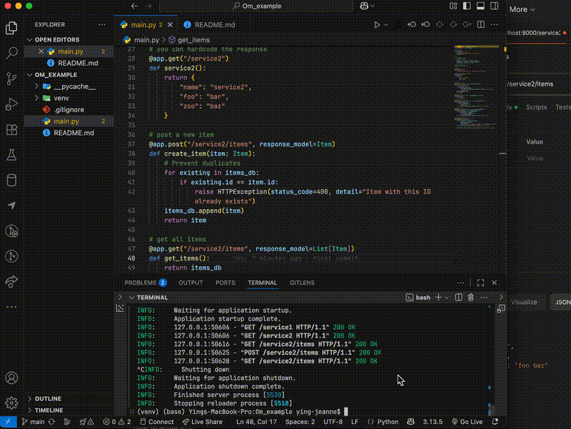

# om_example

## Overview

**om_example** is a simple FastAPI project that demonstrates API with endpoints, including static response, dynamic response with items and the CRUD operations.


  
## Features
- FastAPI-based REST API
- Example endpoints (`/service1`, `/service2`)
- CRUD operations for inventory items (`/service2/items`)

## Setup

### 1. Create a virtual environment
```bash
python -m venv venv
source venv/bin/activate
```

### 2. Install dependencies
```bash
pip install fastapi "uvicorn[standard]" pydantic
```

### 3. Run the server
```bash
uvicorn main:app --reload --host 0.0.0.0 --port 8000
```

## API Endpoints

### Service Endpoints
- `GET /service1` — Returns a simple message.
- `GET /service2` — Returns a hardcoded JSON response.

### Inventory Endpoints
- `POST /service2/items` — Add a new item (id, name, quantity, description).
- `GET /service2/items` — List all items.
- `GET /service2/items/{item_id}` — Get a specific item by ID.
- `PUT /service2/items/{item_id}` — Update an item by ID.
- `DELETE /service2/items/{item_id}` — Delete an item by ID.

## Example Item JSON
```json
{
	"id": 1,
	"name": "Laptop",
	"quantity": 10,
	"description": "A sample item."
}
```

## Notes
- You can add more endpoints by following the patterns in `main.py`.
- The API uses an in-memory list for storage (data will reset on server restart).
